# アーキテクチャ設計書

このドキュメントは、minitoolsプロジェクトのシステムアーキテクチャを説明します。

## システム概要

minitoolsは、複数のソースからコンテンツを収集し、Ollama LLMで処理して、NotionやSlackに出力する自動化フレームワークです。

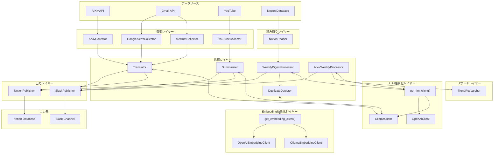

## モジュール依存関係

```mermaid
flowchart TB
    subgraph scripts["scripts/"]
        arxiv["arxiv.py"]
        medium["medium.py"]
        google_alerts["google_alerts.py"]
        youtube["youtube.py"]
        weekly_digest["weekly_digest.py"]
        arxiv_weekly["arxiv_weekly.py"]
    end

    subgraph collectors["minitools/collectors/"]
        AC["ArxivCollector"]
        MC["MediumCollector"]
        GAC["GoogleAlertsCollector"]
        YC["YouTubeCollector"]
    end

    subgraph processors["minitools/processors/"]
        TR["Translator"]
        SU["Summarizer"]
        WDP["WeeklyDigestProcessor"]
        AWP["ArxivWeeklyProcessor"]
        DD["DuplicateDetector"]
    end

    subgraph researchers["minitools/researchers/"]
        TrendR["TrendResearcher"]
    end

    subgraph publishers["minitools/publishers/"]
        NP["NotionPublisher"]
        SP["SlackPublisher"]
    end

    subgraph utils["minitools/utils/"]
        Config["Config"]
        Logger["Logger"]
    end

    arxiv --> AC
    arxiv --> TR
    arxiv --> NP
    arxiv --> SP

    medium --> MC
    medium --> TR
    medium --> NP
    medium --> SP

    google_alerts --> GAC
    google_alerts --> TR
    google_alerts --> NP
    google_alerts --> SP

    youtube --> YC
    youtube --> SU
    youtube --> TR

    weekly_digest --> NR
    weekly_digest --> WDP
    weekly_digest --> SP

    arxiv_weekly --> NR
    arxiv_weekly --> AWP
    arxiv_weekly --> TrendR
    arxiv_weekly --> SP

    AC --> Logger
    MC --> Logger
    GAC --> Logger
    YC --> Logger

    TR --> Config
    TR --> Logger
    SU --> Config
    SU --> Logger
    WDP --> Config
    WDP --> Logger
    AWP --> Logger
    TrendR --> Logger
    DD --> Logger

    NP --> Logger
    SP --> Logger

    Config --> Logger
```

## データフロー図

### ArXiv 論文処理フロー

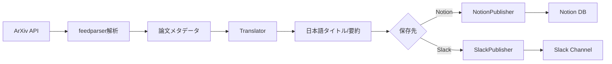

### Medium Daily Digest 処理フロー

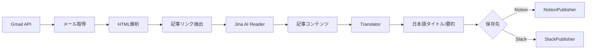

### Google Alerts 処理フロー

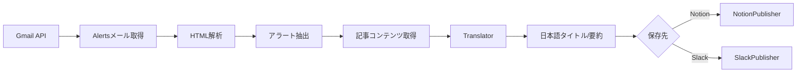

### YouTube 処理フロー

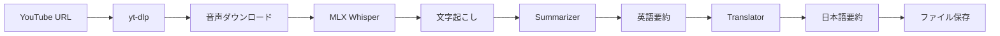

## 外部サービス連携

### LLM抽象化レイヤー

Ollama/OpenAIの両方をサポートするLLM抽象化レイヤー。

| プロバイダー | 用途 | デフォルトモデル | 設定キー |
|-------------|-----|----------------|---------|
| Ollama | 翻訳・要約 | gemma3:27b | `llm.ollama.default_model` |
| OpenAI | 高速処理 | gpt-4o-mini | `llm.openai.default_model` |

**連携パターン（LLM抽象化レイヤー経由）:**
```python
from minitools.llm import get_llm_client

# プロバイダーを指定して取得（省略時は設定ファイルから）
client = get_llm_client(provider="ollama")

# 共通インターフェースで呼び出し
response = await client.chat(
    messages=[{"role": "user", "content": prompt}]
)
```

**従来のパターン（直接使用）:**
```python
import ollama

client = ollama.Client()
response = client.chat(
    model="gemma3:27b",
    messages=[{"role": "user", "content": prompt}]
)
```

### Ollama LLM

ローカルで動作するLLMサーバー。翻訳と要約に使用。

| 用途 | モデル | 設定キー |
|-----|--------|---------|
| 翻訳 | gemma3:27b | `models.translation` |
| 要約 | gemma3:27b | `models.summarization` |
| YouTube要約 | gemma2 | `models.youtube_summary` |

### Gmail API

Medium Daily DigestとGoogle Alertsメールの取得に使用。

**認証フロー:**
1. OAuth2認証（初回のみブラウザ認証）
2. `token.pickle`にリフレッシュトークン保存
3. 以降は自動更新

**必要なスコープ:**
- `https://www.googleapis.com/auth/gmail.readonly`

**連携パターン:**
```python
from googleapiclient.discovery import build

service = build('gmail', 'v1', credentials=creds)
response = service.users().messages().list(
    userId='me',
    q='from:noreply@medium.com'
).execute()
```

### Notion API

処理結果の保存先データベース。

**機能:**
- ページ作成
- 重複チェック（URL検索）
- バッチ保存

**連携パターン:**
```python
from notion_client import Client

client = Client(auth=api_key)
page = client.pages.create(
    parent={"database_id": database_id},
    properties=properties
)
```

**プロパティマッピング（ソース別）:**

| ソース | Title | URL | Summary | その他 |
|-------|-------|-----|---------|-------|
| ArXiv | タイトル | URL | 日本語訳 | 公開日, 概要 |
| Medium | Title | URL | Summary | Japanese Title, Author, Date |
| Google Alerts | Title (日本語) | URL | Summary | Original Title, Source, Tags |

### Slack Webhook

処理完了通知の送信先。

**連携パターン:**
```python
import aiohttp

async with aiohttp.ClientSession() as session:
    async with session.post(webhook_url, json={"text": message}) as response:
        return response.status == 200
```

### Jina AI Reader

Medium記事のコンテンツ取得に使用。

**エンドポイント:** `https://r.jina.ai/{url}`

**特徴:**
- HTMLをMarkdown形式で返却
- Cloudflareによるブロックあり
- User-Agentローテーションで回避

### Tavily API

ArXiv週次ダイジェストでのトレンド調査に使用。

**機能:**
- AI/機械学習分野の最新トレンド検索
- 検索結果のサマリー生成（`include_answer=True`）
- トピック抽出

**連携パターン:**
```python
from tavily import TavilyClient

client = TavilyClient(api_key=api_key)
response = client.search(
    query="AI machine learning latest trends",
    search_depth="basic",
    max_results=5,
    include_answer=True,
)
# response: {answer, results: [{title, url, content}, ...]}
```

**必要な環境変数:**
- `TAVILY_API_KEY`: Tavily APIキー（オプション、未設定時はトレンド調査をスキップ）

## 設定システム概要

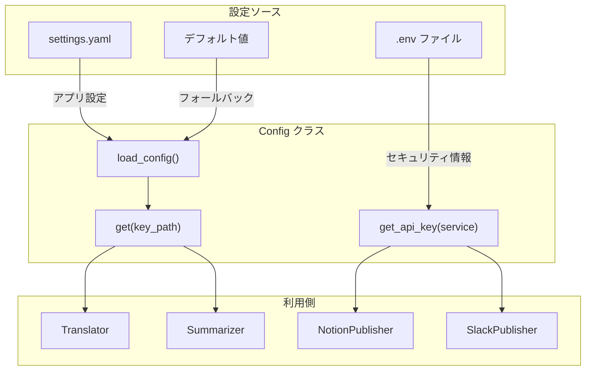

### 設定の優先順位

1. **環境変数** (最高優先)
2. **settings.yaml**
3. **デフォルト値** (最低優先)

### 設定ファイルの役割分担

| ファイル | 内容 | 例 |
|---------|------|---|
| `.env` | セキュリティ情報 | APIキー、Webhook URL |
| `settings.yaml` | アプリ設定 | モデル名、並列数、デフォルト値 |

## 非同期処理アーキテクチャ

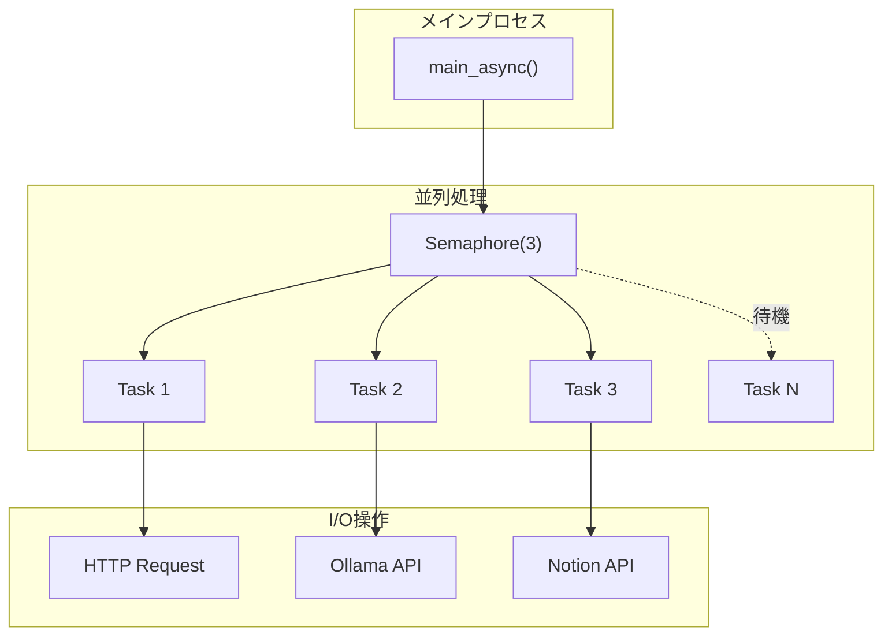

### 並列制限の設定

| 項目 | デフォルト値 | 設定キー |
|-----|------------|---------|
| 記事処理 | 10 | `processing.max_concurrent_articles` |
| Ollama API | 3 | `processing.max_concurrent_ollama` |
| Notion API | 3 | `processing.max_concurrent_notion` |
| HTTP接続 | 10 | `processing.max_concurrent_http` |

## デプロイメントアーキテクチャ

### ローカル実行

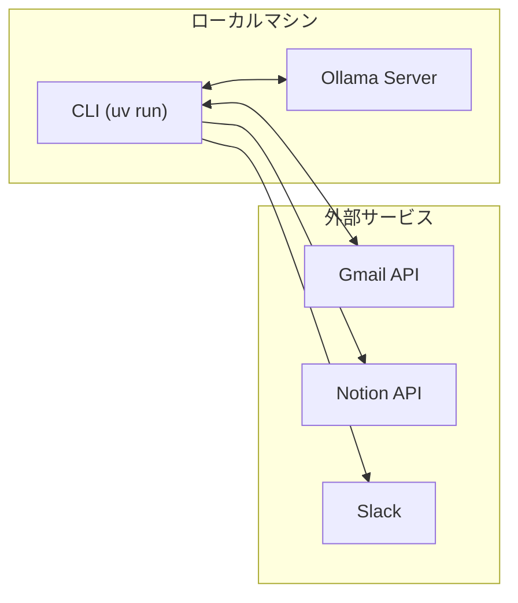

### Docker実行

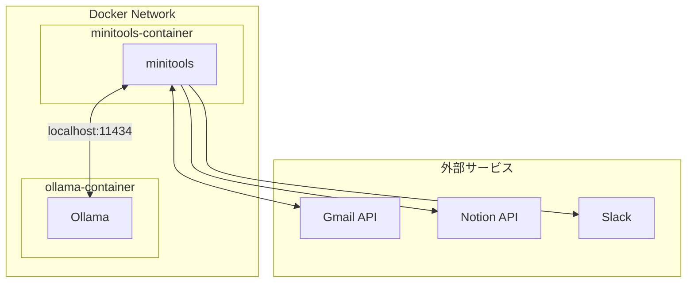

## エラー回復戦略

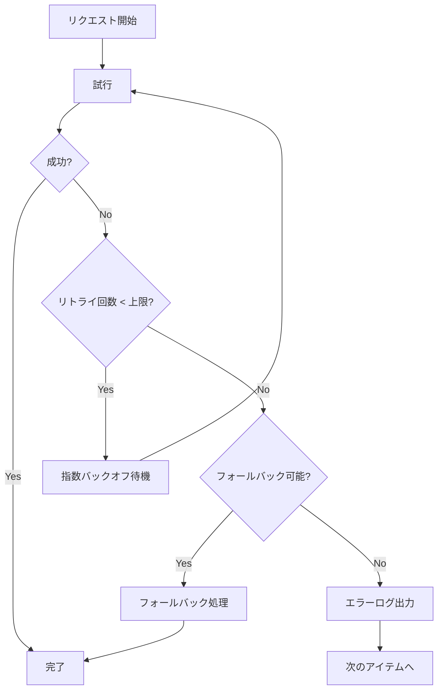

### フォールバック戦略

| シナリオ | フォールバック |
|---------|--------------|
| Jina Reader ブロック | メールのプレビューテキストを使用 |
| 記事コンテンツ取得失敗 | スニペットを使用 |
| 翻訳エラー | 元のテキストを返却 |
| mlx-whisper 未インストール | エラーメッセージを表示して終了 |
