# Mermaid図

このドキュメントは、minitoolsプロジェクトの処理フローとクラス関係をMermaid図で説明します。

## ツール別シーケンス図

### ArXiv 処理フロー

### Medium Daily Digest 処理フロー

### Google Alerts 処理フロー

### YouTube 処理フロー

### Weekly Digest 処理フロー

### ArXiv Weekly Digest 処理フロー

## クラス関係図

```mermaid
classDiagram
    class ArxivCollector {
        +str base_url
        +ClientSession http_session
        +__aenter__()
        +__aexit__()
        +search(queries, start_date, end_date, max_results)
        +fetch_paper_details_async(paper_url)
    }

    class MediumCollector {
        +Service gmail_service
        +ClientSession http_session
        +str credentials_path
        +__aenter__()
        +__aexit__()
        +get_digest_emails(date)
        +parse_articles(html_content)
        +fetch_article_content(url, max_retries)
        +extract_email_body(message)
        -_authenticate_gmail()
        -_clean_url(url)
        -_extract_author_from_jina(content)
    }

    class GoogleAlertsCollector {
        +Service gmail_service
        +str credentials_path
        +get_alerts_emails(hours_back, date)
        +parse_alerts(message)
        +fetch_article_content(url, retry_count)
        +fetch_articles_for_alerts(alerts)
        -_authenticate_gmail()
        -_extract_body(message)
    }

    class YouTubeCollector {
        +Path output_dir
        +str whisper_model
        +dict ydl_opts
        +download_audio(url)
        +transcribe_audio(audio_file)
        +process_video(url)
        +get_video_info(url)
    }

    class Translator {
        +str model
        +Client client
        +translate_to_japanese(text, context)
        +translate_with_summary(title, content, author)
    }

    class Summarizer {
        +str model
        +Client client
        +summarize(text, max_length, language)
        +extract_key_points(text, num_points)
    }

    class NotionPublisher {
        +str api_key
        +str source_type
        +Client client
        +check_existing(database_id, url)
        +create_page(database_id, properties)
        +save_article(database_id, article_data)
        +batch_save_articles(database_id, articles, max_concurrent)
        -_normalize_url_by_source(url)
        -_build_article_properties(article_data)
        -_build_arxiv_properties(article_data)
        -_build_medium_properties(article_data)
        -_build_google_alerts_properties(article_data)
    }

    class SlackPublisher {
        +str webhook_url
        +ClientSession http_session
        +__aenter__()
        +__aexit__()
        +set_webhook_url(webhook_url)
        +send_message(message, webhook_url)
        +format_articles_message(articles, date, title)
        +send_articles(articles, webhook_url, date, title)
    }

    class Config {
        -Config _instance
        -dict _config
        -bool _initialized
        +load_config()
        +get(key_path, default)
        +get_api_key(service)$
        +reload()
        +to_dict()
    }

    class Article {
        +str title
        +str url
        +str author
        +str preview
        +str japanese_title
        +str summary
        +str japanese_summary
        +str date_processed
    }

    class Alert {
        +str title
        +str url
        +str source
        +str snippet
        +str japanese_title
        +str japanese_summary
        +str date_processed
        +str article_content
        +str email_date
        +List~str~ tags
    }

    class NotionReader {
        +str api_key
        +Client client
        +get_articles_by_date_range(database_id, start_date, end_date, date_property)
        +get_database_info(database_id)
        -_page_to_article(page)
        -_extract_property_value(prop)
    }

    class WeeklyDigestProcessor {
        +BaseLLMClient llm
        +BaseEmbeddingClient embedding_client
        +int max_concurrent
        +bool dedup_enabled
        +float similarity_threshold
        +float buffer_ratio
        +rank_articles_by_importance(articles)
        +select_top_articles(articles, top_n, deduplicate, buffer_ratio, similarity_threshold)
        +generate_trend_summary(articles)
        +generate_article_summaries(articles)
        +process(articles, top_n, deduplicate)
    }

    class DuplicateDetector {
        +BaseEmbeddingClient embedding_client
        +float similarity_threshold
        +detect_duplicates(articles)
        +select_representatives(groups, top_n)
        -_prepare_text(article)
        -_compute_embeddings(articles)
        -_cluster_by_similarity(embeddings)
    }

    class UnionFind {
        +List~int~ parent
        +List~int~ rank
        +find(x)
        +union(x, y)
        +get_groups()
    }

    class TrendResearcher {
        +str api_key
        +TavilyClient client
        +get_current_trends(query, max_results)
        -_extract_trends(response)
        -_generate_summary_from_results(results)
    }

    class ArxivWeeklyProcessor {
        +BaseLLMClient llm
        +TrendResearcher trend_researcher
        +int max_concurrent
        +rank_papers_by_importance(papers, trends)
        +select_top_papers(papers, top_n)
        +generate_paper_highlights(papers)
        +process(papers, top_n, use_trends)
        -_translate_trend_summary(trend_info)
        -_safe_get_score(value, default)
    }

    DuplicateDetector --> UnionFind : uses
    ArxivWeeklyProcessor --> TrendResearcher : uses
    ArxivWeeklyProcessor --> BaseLLMClient : uses

    class BaseLLMClient {
        <<abstract>>
        +chat(messages, model)*
        +generate(prompt, model)*
    }

    class BaseEmbeddingClient {
        <<abstract>>
        +embed_texts(texts)*
        +embed_text(text)*
    }

    class LangChainOllamaClient {
        +str default_model
        +chat(messages, model)
        +generate(prompt, model)
        +chat_json(messages, model)
    }

    class LangChainOpenAIClient {
        +str api_key
        +str default_model
        +chat(messages, model)
        +generate(prompt, model)
        +chat_json(messages, model)
    }

    class OllamaEmbeddingClient {
        +str model
        +embed_texts(texts)
        +embed_text(text)
    }

    class OpenAIEmbeddingClient {
        +str model
        +embed_texts(texts)
        +embed_text(text)
    }

    MediumCollector ..> Article : creates
    GoogleAlertsCollector ..> Alert : creates

    Translator --> Config : uses
    Summarizer --> Config : uses
    NotionPublisher --> Config : uses

    WeeklyDigestProcessor --> BaseLLMClient : uses
    WeeklyDigestProcessor --> DuplicateDetector : uses
    DuplicateDetector --> BaseEmbeddingClient : uses

    LangChainOllamaClient --|> BaseLLMClient : implements
    LangChainOpenAIClient --|> BaseLLMClient : implements
    OllamaEmbeddingClient --|> BaseEmbeddingClient : implements
    OpenAIEmbeddingClient --|> BaseEmbeddingClient : implements
```

## 非同期処理の状態遷移図

## 設定読み込みフロー図

## バッチ処理フロー図

## URL正規化フロー図

## エラーリカバリーフロー図

